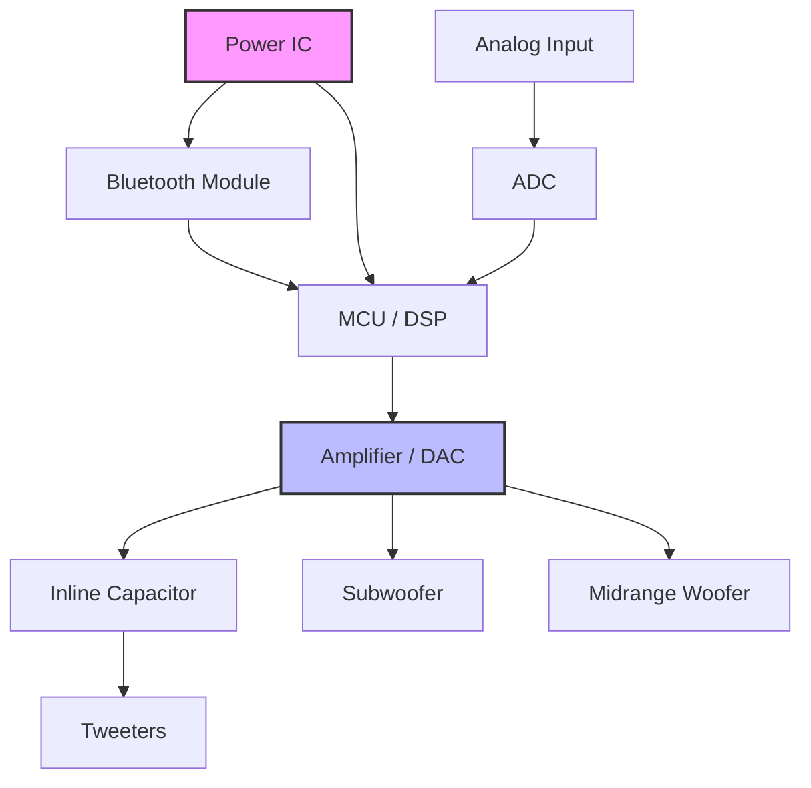

High quality speakers require a variety of good materials and design decisions, ours are outlined below.
****

## Audio Path

We will have a single audio path from source to speaker. Though, we will have multiple sources that will be able to feed into the audio path. 

The primary source for audio will be a Bluetooth Audio sink. Details on the bluetooth module selected are below, though the MCU should be able to accept *any* bluetooth module's I$^2$S signal, if we do decide to switch in the future.

We will design with a secondary source: a analog audio input. This will be fed through our MCUs Analog to Digital Converter (ADC) which will provide us with a 16-bit resolution of the analog signal. This is the standard for CD quality audio, which we believe is high quality enough (without needing to find advanced, expensive, and specialized ICs for 24-bit depth audio).

### [Crossover](https://en.wikipedia.org/wiki/Audio_crossover)

We have the option between a digital DSP, or a passive crossover. Passive crossovers are inherently limited in that they are only able to separate set frequencies without the ability to tune without re-soldering and re-spec-ing components (but they are very cool to design). 

For this reason, it makes more sense for us to go with a digital crossover. DSPs can handle frequency separation, given there is a sufficiently powerful MCU running it. 

One concern is that the digital crossover doesn't provide protection to the speakers (primarily the tweeters, who will die if we give them super low frequencies) if there is a logic error or issue with the DSP. To ensure that we can still have a safeguard, we can add a high-pass filter with an inline capacitor to act as a passive safeguard if something does happen upstream.

### MCU/DSP

To handle high fidelity sound and to process it locally, we need to have a way to ensure that we can process audio in real time. As a result, we'll opt to use the STM32H7 chipset.

It is easy to come by (we can also buy samples). Since we are not currently looking to make our speaker portable with a battery, we don't need to worry much about having a low power consumption chip. We also have experience with STM32.

This chipset comes with 16 bit ADCs, which should be good enough to sample analog audio and process it directly.

### Bluetooth Audio

#### BM83

| ![[BM83 Reference Design.png\|600]]                                                                         |
| ----------------------------------------------------------------------------------------------------------- |
| https://ww1.microchip.com/downloads/en/DeviceDoc/BM83%20Embedded%20Mode%20Reference%20Circuit.pdf#page=4.00 |

### Analog Input

Acceptable from a regular headphone jack leading directly into our MCU.

16-bit resolution audio will then be passed to the DSP running on the MCU and be used to form the digital crossover. 