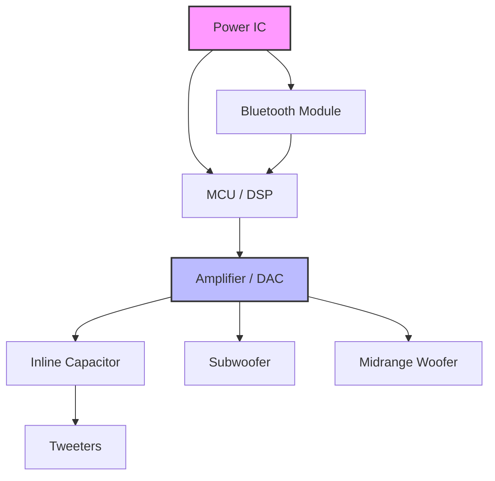

High quality speakers require a variety of good materials and design decisions, ours are outlined below.
****

### [Crossover](https://en.wikipedia.org/wiki/Audio_crossover)

We have the option between a digital DSP, or a passive crossover. Passive crossovers are inherently limited in that they are only able to separate set frequencies without the ability to tune without resoldering and re-spec-ing components. 

For this reason, it makes more sense for us to go with a digital crossover. DSPs can handle frequency separation, given there is a sufficiently powerful MCU running it. 

One concern is that the digital crossover doesn't provide protection to the speakers (primarily the tweeters, who will die if we give them super low frequencies) if there is a logic error or issue with the DSP. To ensure that we can still have a safeguard, we can add a high-pass filter with an inline capacitor to act as a passive safeguard if something does happen upstream.

### MCU/DSP

To handle high fidelity sound and to process it locally, we need to have a way to ensure that we can process audio in real time. As a result, we'll opt to use the STM32H7 chipset. 

It is easy to come by (we can also buy samples). Since we are not currently looking to make our speaker portable with a battery, we don't need to worry much about having a low power consumption chip. We also have experience with STM32.

### Bluetooth Audio