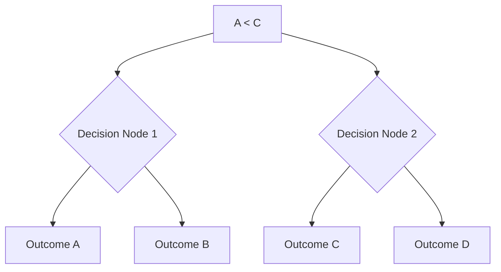

## Comparison Based Sorting

```mermaid
graph TD
    A[A < C] --> B{Decision Node 1};
    A --> C{Decision Node 2};
    B --> D[Outcome A];
    B --> E[Outcome B];
    C --> F[Outcome C];
    C --> G[Outcome D];

```
