## Systems
Systems can eventually be simplified so we can analyze them easily.

$x(s)\to \boxed{t(s)}\to y(s)$

Where we can analyze $t(s)$ with [[Inverse Laplace Transform|inverse Laplace transforms]].
## Signals

### Input
- **Reference** (generally a step or ramp): $r(t), R(s)$

### Perturbations
- **Disturbance**: $w(t), W(s)$
- **Sensor Noise**: $v(t), V(s)$

### Output
- **Output response**: $y(t), Y(s)$

We always want $y(t)$.

## Analysis

1. Is the plant $G(s)$ stable?
2. Where are the poles/zeros?
	   $G(s) = \frac{b(s)}{a(s)}$ where the poles are roots of $a(s)=0$ and zeros are roots of $b(s)=0$
3. What does the impulse response, step response, and ramp response look like?
4. Is the time-domain behavior acceptable?

## Reviewid1((Some text))

<iframe src="https://www.desmos.com/calculator/jwltflzedt?embed" width="500" height="500" style="border: 1px solid #ccc" frameborder=0></iframe>

## Open Loop Topology

In theory, if we don't like the behavior of the Plant, we can design the controller to replace the poles:

$\to \boxed{Dc(s)}\to \boxed{G(s)}\to$

This is an open loop with no feedback:

$$
\begin{align}
G(s)=\frac{b(s)}{a(s)} \\
Dc(s)=\frac{c(s)}{d(s)}
\end{align}
$$

The overall transfer function becomes:

$$
\begin{align}
T(s)=Dc(s)G(s) \\
T(s)=\frac{c(s)}{d(s)} \times \frac{b(s)}{a(s)}
\end{align}
$$

If $c(s)=a(s)$, we can cancel the poles of the Plant and replace them with $d(s)$. The plant **must** be **stable** for us to do this. Pole cancellation **does not** work on unstable plants.

## Closed Loop Topology

```mermaid
flowchart LR
id1((Σ)) --> id2("Dc(s)")
id2 --> id3("G(s)")
```

If the output 

### Example of Closed Loop Inspection

$$
\begin{align}
G(s)=\frac{1}{s^2+3s-4}=\frac{b(s)}{a(s)} \\
a(s)=s^2+3s-4 = a_{2}s^2+a_{1}s+a_{0} \\
\text{Stable if a}<0 \\
\text{Do quadratic equation/factor to find poles} \\
s=-4,s=+1 \\
\end{align}
$$

This must be unstable because there is a pole in the Ride-hand plane/

**Can the plant be made stable?**

2. Move the unstable pole from the RHP to the LHP. How do we do this? **feedback**

In a PID controller, $Dc(s)=k$, where $k$ is a constant gain.

Note that $\to \boxed{k}\to \boxed{G(s)}\to$ is forward gain, which is equivalent to $\to \boxed{KG(s)}\to$

The $H(s)$ is the feedback gain.

When $k=1$, we call it **unity gain**.

### Example of Control System with Unity Gain

