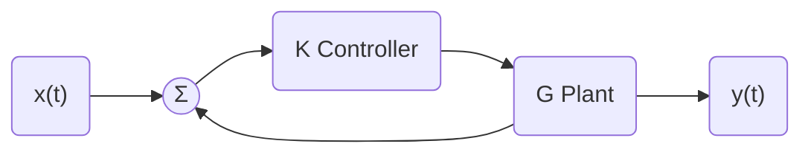

From last time, the plant was given to us as $G(s)=\frac{1}{s^2+3s-4}$ which is unstable. 

We tried to use a p-controller $Dc(s)=k$ to see how this affected the stability of the plant. That is, can we **move** the unstable pole to the left hand plane?

Here, we can find the closed-loop transfer function.

$$
T(s)=\frac{kG}{1+kG}=\frac{kb(s)}{q(s)+kb(s)} \text{where } G(s) = \frac{b(s)}{a(s)}
$$

As $k$ gets larger, the characteristic equation of the plant ($b(s)$) acts as 0.

Two real poles → overdamped, two complex poles, underdamped, two identical poles, critically damped.

In this case, $T(s)=\frac{k}{s^2+3s+(k-4)}$.

### What is the DC gain of this system?

Using final value theorem, the DC gain is the ratio of the output of a system to its input (presumed constant) after all transients have decayed to zero. To find the DC gain, we assume there is a **unit-step input** and apply the final value theorem.

$$
\text{DC Gain}=\lim_{ s \to 0 } sG(s)\times \frac{1}{s}=\lim_{ s \to 0 } G(s)
$$

So from above, the DC gain of $T(s)=\frac{k}{(k-4)}$.

Last time, we tried $k-1,5,24$ but $k=1$ is unstable, $k=5$ has a DC gain $=\frac{5}{1}=5$, and $k=24$ has DC gain of $\frac{24}{20}=1.2$.

> [!FAQ]+ Does changing the DC gain affect stability?
> No. Pole location is the only thing that affects the stability, smaller/bigger gain will change the signal strength, but not change the stability.

To do a comparison of the time domain response (step response), lets normalize $T(s)$ such that the DC gain is $=1$.

First, let's see if we can figure out how the poles are moving.

Let's say we have the following characteristic equation:

$$
a(s)=s^2+4s+(k-4)
$$

If we use the quadratic equation:

$$
\begin{align}
s=\frac{-3\pm \sqrt{ 3^2-4(1)(k-4) }}{2} \\
s=\frac{{-3\pm \sqrt{ {2}5-4k }}}{2} \\
T(s)=\frac{k}{s^2+3s+(k-4)}\times \frac{k-4}{k} \\
k\;\text{is the DC correction factor.}
\end{align}
$$

$G$ is the plant alone. $Tn$ is $T(s)$ with $Dc(s)=k=n$ (a P-controller).

We note that from the quadratic equation result, $s=\frac{{-3\pm \sqrt{ 24-4k }}}{2}$. If $(25-4k)=0$, we'll end up with a double real root at $s=-\frac{3}{2}\pm 0$ which is a double root.

This happens when $25-4k\to k=6.25$.

When the poles are real, we get an exponential solution: $y(t)=k_{1}e^{-\sigma_{1}t}+k_{2}e^{-\sigma_{2}t}$ which is real and distinct.

Rise time is until 90% of setpoint, not the full setpoint.

We see that when poles are real, we get an exponential solution.

**Figure 3.16 in textbook**. $b(s)=b_{0}x(t)$. NO zeros.

## Canonical Form of the 2nd-order ODE

This is very important for understanding our time-domain responses.

If we have $a(s)=a_{2}y''(t)+a_{1}y'(t)$

$a(s)=a_{2}s^2+a_{1}s+a_{0}=0$

We want $a(s)$ to be **monic**, divide by $G_{2}$

$$
1\cdot s^2+\frac{a_{1}}{a_{2}}+\frac{a_{0}}{a_{2}}=0
$$

where $a_{2}$ is just constant.