## Plants

$G$ is the plant.

$D_{C}$ is the controller that feeds input signals to the plant.

Decay is $e^{-\sigma t}$. 

```mermaid
flowchart LR
Sigma --> Dc
Dc --> G
G -->|—| Sigma
G --> y(s)
r --> Sigma

```

## Useful Theorems

### Final Value Theorem

$$
\lim_{ t \to \infty } g(t)=\lim_{ s \to \infty } sG(s)
$$

This is only true if the limit exists. The limit can only exist if the Plant is stable.

### Initial Value Theorem

$$
g(0^+)=\lim_{ s \to \infty } sG(S)
$$

### Response

In this class:
- **Unit Impulse**: $x(t)=\delta(t)$ 
- **Unit Step**: $x(t)=1(t)$
- **Unit Ramp**: $t \cdot 1(t)$
- **Sinusoidal**: $tbd$

What is the difference between these systems?

$$
\begin{align}
G_{1}(s)=\frac{2}{s^2+3s+2} =\frac{b(s)}{a(s)}, \text{C.E.}\; a(s)=0 \\
G_{2}(s)=\frac{2}{s^2+2s+2} \\
G_{3}(s)=\frac{2}{s^2+\sqrt{ 8s }+2}
\end{align}
$$

**Necessary condition for stability in Higher order ODE**: make sure that all coefficients are present and positive.

For second order, to check for stability, we need to get the roots and make sure they are all positive.

$$
\begin{align}
G_{1}\to s^2+3s+2=0 \\
(s+1)(s+2)=0 \to s=-1,s=-2 \\
G_{2}\to s^2+2s+2=0 \\
(s+1)^2+2-1^2 \\
(s+1)^2+1=0, s=-1\pm j_{1}
\end{align}
$$
