## Plants

$G$ is the plant.

$D_{C}$ is the controller that feeds input signals to the plant.

Decay is $e^{-\sigma t}$. 

```mermaid
flowchart LR
Sigma --> Dc
Dc --> G
G -->|—| Sigma
G --> y(s)
r --> Sigma

```

## Useful Theorems

### Final Value Theorem

$$
\lim_{ t \to \infty } g(t)=\lim_{ s \to \infty } sG(s)
$$

This is only true if the limit exists. The limit can only exist if the Plant is stable.

### Initial Value Theorem

$$
g(0^+)=\lim_{ s \to \infty } sG(S)
$$
