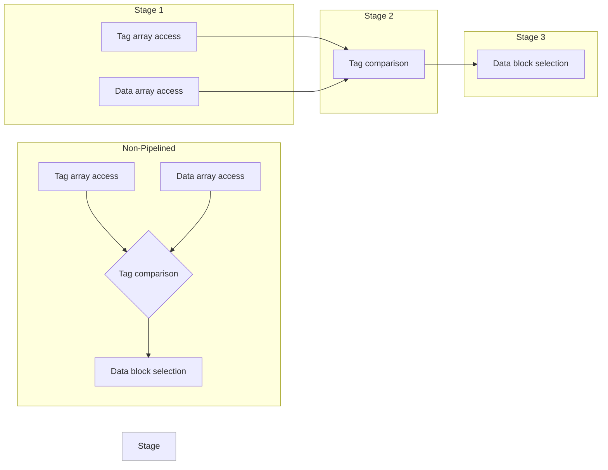

## Structure of a Cache

## Content Addressable Memory (CAM) Cells

## Cache Line Replacement Policy

Implementing replacement policies is difficult, even for moderate cache associativities. 

This makes no difference in a [[Cache Performance|direct mapped cache]] ($A=1$)

We can instead use 1 bit per set to keep track of MRU or LRU. At $A=2$, this increases to 3. At $A=3$, it reaches 3 bits per set. 

> [!FAQ] What about $A=4$?
> We need 5 bits to encode the $4!$ possibilities. 
> Bit 0: Way 1 MRU than Way 0.  
> Bit 1: Way 2 MRU than Way 0.  
> Bit 2: Way 3 MRU than Way 0.  
> Bit 3: Way 2 MRU than Way 1.  
> Bit 4: Way 3 MRU than Way 1.  
> Bit 5: Way 3 MRU than Way 2.
> We can build a FSM using this state encoding and two-bit encoding for the current access to determine next state and victim way. The theoretical minimum encoding of states requires $\lceil \log(4!) \rceil=5$ bits.

### Pseudo-LRU (Tree-PLRU)

An efficient algorithm to select and item that **most likely** has not been accessed recently, given a set of items and sequence of access events to the items.

This needs $A-1$ bits to represent the branch points of a binary decision tree. 

Results in a simple FSM for picking the victim way on a miss or updating the state on a hit in a given way.

## Advanced Cache Design Choices

If best-case cache access latency is still multiple processor cycles, we can improve throughput by designing a **pipelined cache**. 

If we have a cache miss, we can avoid stalling later memory operations by designing a **non-blocking cache**.

## Pipelined Cache

We will do this by adding pipeline registers between cache stages.

Read:
- Three-stage pipeline: access tag and data arrays, compare tags, select data block.

Write:
- Three-stage pipeline: access tag array, compare tags, write in data array.

## Non-Blocking Cache Basics

Memory access $A_{1}$ to address $m_{1}= <t_{i},i_{1},f_{1}>$ results in a $D\$$ miss. Let $b_{1}= <t_{1},i_{1}>$ be its memory block number.

While this miss is being handled, a second memory access $A_{2}$ to address $m_{2}= <t_{2},i_{2},f_{2}>$ arrives. Let $b_{2}= <t_{2},i_{2}>$ be its memory block number.

Several cases arise, depending on whether $m_{1}$ and $m_{2}$ reference the same memory block, whether access $A_{2}$ is a read or write, and whether access $A_{2}$ is a hit or a miss.

The implication of this non-blocking structure is that memory operations may be completed out of order. Implementing this policy requires a mechanism for recording outstanding (in-flight) cache misses.

### Mechanism: Miss Status Holding Register (MSHR)

For each missed memory block, we have an associated miss queue. In it, we can put the read/write event, word address, tag, and the store value. 

On a **primary miss** (no other miss to this same block) for a memory block, and entry is created for the block in its MSHR. We can use a CAM to do the comparison for the addresses. If there are no free entries, the request blocks. We also create an entry in the miss queue of this MSHR entry.

Another miss to the same memory block that arrives while the primary miss is being handled is called a **secondary miss**.
1. If it is a write, we can simply append to the tail of the miss queue.
2. If it is a read, we can search for earlier writes in the miss queue to the same set of bytes.
	1. If we find an entry, the value is forwarded
	2. Otherwise, we enqueue the entry.
When the primary miss is handled, its miss queue is drained.