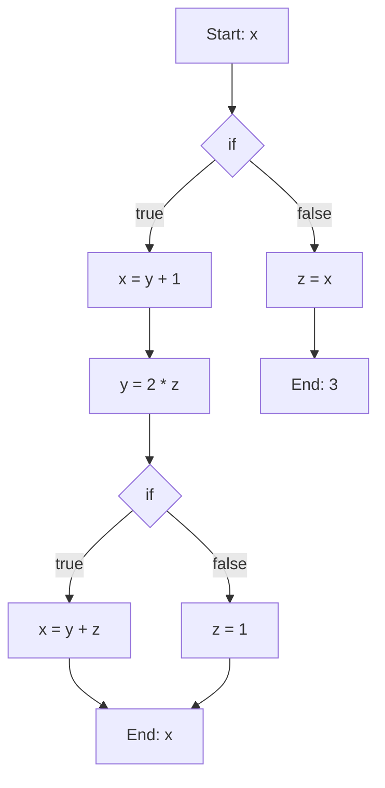

## What is it

When optimizing programs, we need to know the way data is passed through functions and different branches. This is important in making sure that the optimized program is the equivalent to the original program.

## Inference Rules Extended

This extends the first, follow, and nullable sets we learned [[Inference Rules|earlier]].

### Follow
$\$\in \text{FOLLOW}(S)$

$\text{FOLLOW}(S)=\text{FOLLOW}(S)\cup\{\$\}$

The follow set is the [[Power Set|power set]] of $T$ terminals, and thus has $2^T$ elements.

## Using Fixpoint Theorem for Dataflow Analysis

We want to be able to expose opportunities for optimization that are safe to be done. We, for this reason, need to keep track of the flow of expressions through the program. This all follows the lattice theory and set theorems we talked about in being able to [[Solving Fixpoint Equations|solve fixpoint equations]].

This is within a single procedure, though it is possible to do inter-procedural dataflow analysis.

We can do a topological sort if we have a directed acyclic graph (DAG), but this assumption goes away as soon as we have loops and therefore no longer have an acyclic graph. For these situations, it is important to start using the fixpoint methods to optimize. 

