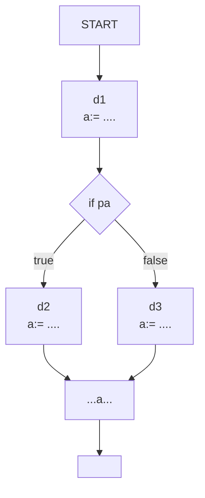
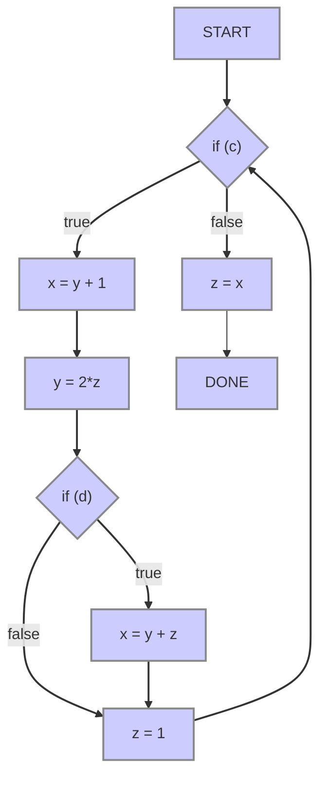

## What is it

When optimizing programs, we need to know the way data is passed through functions and different branches. This is important in making sure that the optimized program is the equivalent to the original program.

## Inference Rules Extended

This extends the first, follow, and nullable sets we learned [[Inference Rules|earlier]].

### Follow
$\$\in \text{FOLLOW}(S)$

$\text{FOLLOW}(S)=\text{FOLLOW}(S)\cup\{\$\}$

The follow set is the [[Power Set|power set]] of $T$ terminals, and thus has $2^T$ elements.

## Using Fixpoint Theorem for Dataflow Analysis

We want to be able to expose opportunities for optimization that are safe to be done. We, for this reason, need to keep track of the flow of expressions through the program. This all follows the lattice theory and set theorems we talked about in being able to [[Solving Fixpoint Equations|solve fixpoint equations]].

This is within a single procedure, though it is possible to do inter-procedural dataflow analysis.

We can do a topological sort if we have a directed acyclic graph (DAG), but this assumption goes away as soon as we have loops and therefore no longer have an acyclic graph. For these situations, it is important to start using the fixpoint methods to optimize. 

### Dataflow Equations

System of fixpoint equations in which unknowns are solutions to the dataflow problem at different points in program.

Solve the system of equations as described in previous lecture.

For many problems, this gives the meet-over-paths (MOP) solution, and for other problems, it gives a "safe" approximation to the MOP solution.

We'll solve it using fixpoint equations.

### Reaching Definitions: Multiple Variables

You can solve for one variable at a time, but its better to solve for all of them at once.

### Observations of the Fixpoint Approach

System of equations can be solved to find the least solution. The iterative method for solving equations will converge even though there are an unbounded number of paths in the program. 

## Live Variables

Variable $v$ is live at a point $p$ in a CFG if there is a path from $p$ to `END` on which there is a use of $v$ before any definition of $v$. We want to be computing the set of variables that are live at each point in the program.

## Classifications of Dataflow Problems

**Direction of Information Propagation**:
- **Forward-flow**: information propagates in the direction of control-flow from the input to output
- **Backward-flow**: information propagates in the reverse direction of control-flow from the output to input

**All-paths vs. any-path**:
- **All-paths problem**: dataflow fact is true at some point in the program if it is true along **all** paths to/from that point
- **Any-path problem**: dataflow fact is true at some point in the program if it is true along **any** path to/from that point

|               | Forward                                        | Backward                  |
| ------------- | ---------------------------------------------- | ------------------------- |
| **Any-Path**  | Reaching Definitions                           | Live Variables            |
| **All-Paths** | Constant Propagations Available Expressions | Anticipatable Expressions |

In a backward-flow problem, the information at $p$ depends on the paths from $p$ to `END`.

In an any-path problem, a variable is live at $p$ if there is any path from $p$ to `END` that satisfies the condition.

The [[Solving Fixpoint Equations#Domain|domain]] of this is the [[Power Set|power set]] of the set of variables in the procedure.

> [!FAQ] How can reaching definitions be classified?
> They are classified as **forward-flow**, **any-path** because you follow the control flow graph, and any way to reach a node includes the dataflow fact.

## Available Expressions

An expression $x \text{ op } y$ is available at $p$ if every path from `START` to $p$ contains an evaluation of $x \text{ op} y$ after which there are no assignments to $x$ or $y$.

This is a forward-flow, all-paths problem.

The domain for this is the power set of the expressions of interest.

If we have $x= y\text{ op } z$:
- $\text{Out}=(\text{In}-\text{Ex}) \cup\{y\text{ op } z\}$

The confluence operator is intersection. 

We compute the greatest solution, start by assuming all expressions are available everywhere except at `START` and iterate.

This is finding **total redundancy**.

## Anticipatable Expressions (Busy Expression)

An expression $x\text{ op } y$ is anticipatable at $p$ if every path from $p$ to `END` contains an evaluation of $x\text{ op } y$ before any assignment to $x$ or $y$. This tells you it is safe to compute the expression at this point.

This is a backward-flow, all-paths problem.

The domain for this is the power set of expressions of interest.

If we have $x=y\text{ op } z$:
- $\text{In}=(\text{Out}-\text{Ex})\cup\{y\text{ op }z\}$

The confluence operator is intersection. 

We compute the greatest solution, start by assuming all expressions are anticipatable everywhere except at `END` and iterate.

This is called **partial redundancy elimination (or PRE)**.

## Constant Propagation

A variable $x$ is a constant $c$ at a point $p$ if $x$ has the value $c$ at that point on **all** paths from `START` to that point.

This is a forward-flow, all-paths problem.

We perform constant propagation on a set of variables $V$.

The dataflow information at point $p$ is a vector of size $|V|$ where each value comes from the domain.

If we have $x=e$:
- $\text{Out}=\text{In}\left[ \frac{\text{Eval}(e)\text{ in In}}{x} \right]$

The confluence operator is join.

We compute by initializing all the vectors to $[\bot, \bot, \ldots]$ except at `START` where it is $[\top, \top, \ldots]$.

The solution to dataflow equations does not give meet-over-paths solutions in general, it gives a safe approximation.

Using vectors to represent the values of variables is inefficient, assignment is to one variable but values of other variables must be copied from the input vector to the output vector. 

For structured programs, you can skip iteration and use elimination-based methods. For unstructured, you need to use an iterative method.

interval analysis.