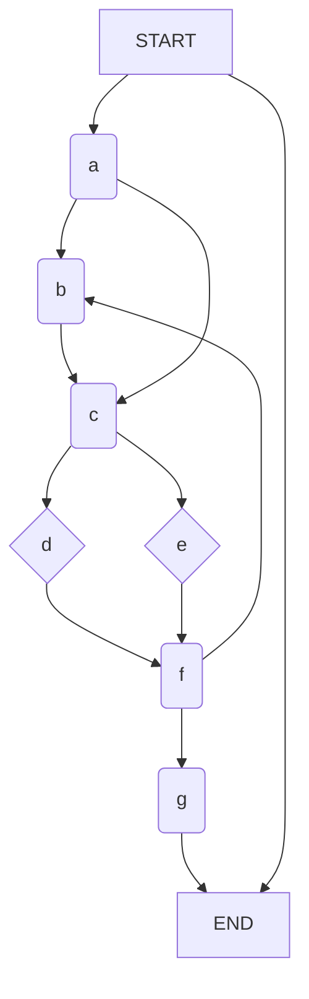

## What is a Dominator

In a [[Control Flow Graphs|control flow graph]] $G$, node $a$ is said to dominate node $b$ if every path from `START` to $b$ contains $a$.

### Dominance Properties

- **Reflexive**: $a\text{ dom } a$
- **Anti-symmetric**: $a\text{ dom } b$ and $b\text{ dom } a\implies a=b$
- **Transitive**: $a\text{ dom } b\cap b\text{ dom }c \implies a\text{ dom } c$
- **Tree-structured**:
	- $a\text{ dom } c \cap b\text{ dom }c\implies a\text{ dom } b \;\cup\;b\text{ dom }a$
	- Intuitively, this means that dominators of a node are themselves ordered by dominance

### Dominance Relation: relation on nodes

We write $a\text{ dom }b$ if $a$ dominates $b$.

#### Computing Dominance Relation

The domain of this relation is the [[Power Set|power set]] of nodes in the CFG.

There is a [[Dataflow Analysis|dataflow problem]]. If we have a node with multiple inputs, how do we get dataflow information.

$\text{Dom}(N)=\{N\}\cup M \in\text{pred}(N)\cap\text{Dom}(M)$.

### Example CFG

|       | Start | A   | B   | C   | D   | E   | F   | G   | END |
| ----- | ----- | --- | --- | --- | --- | --- | --- | --- | --- |
| Start | x     | x   | x   | x   | x   | x   | x   | x   | x   |
| A     |       | x   | x   | x   | x   | x   | x   | x   |     |
| B     |       |     | x   |     |     |     |     |     |     |
| C     |       |     |     | x   | x   | x   | x   | x   |     |
| D     |       |     |     |     | x   |     |     |     |     |
| E     |       |     |     |     |     | x   |     |     |     |
| F     |       |     |     |     |     |     | x   | x   |     |
| G     |       |     |     |     |     |     |     | x   |     |
| END   |       |     |     |     |     |     |     |     | x   |

### Building Dominator Tree Directly

Based on depth-first-search (DFS) of graph.

$O(E*\alpha(E))$ where $E$ is the number of edges in a CFG.

This runs in essentially linear time (the inverse Ackermann function $\alpha$ grows incredibly slowly).

There is a linear time algorithm, but its a lot more complex and not efficient to implement for extremely large graphs.

## Immediate Dominators

The immediate dominator of a node $n$ is the parent of the node on all paths, if it exists.
- Denoted as $\text{idom}(n)$
- There is no $\text{idom}$ for `START`

As a result, all dominators of $n$ other than $n$ itself dominate $\text{idom}(b)$.

## Postdominators

Given a CFG $G$, node $b$ is said to postdominate node $a$ if every path from $a$ to `END` contains $b$
- Denoted as $b\text{ pdom } a$ to say that $b$ postdominates $a$

Postdominance is dominance in reverse CFGs obtained by reversing the direction of all edges and interchanging the roles of `START` and `END`.

There is a **caveat**: $a\text{ dom } b$ does **not necessarily imply** $b\text{ pdom } a$.

### Immediate Postdominator

The immediate post-dominator of a node $n$ is the child of the node on all paths, if it exists.
- Denoted as $\text{ipdom}$.

## Strict Postdominance

A node $w$ is said to strictly postdominate a node $u$ if $w \neq u \wedge w\text{ pdom }u$